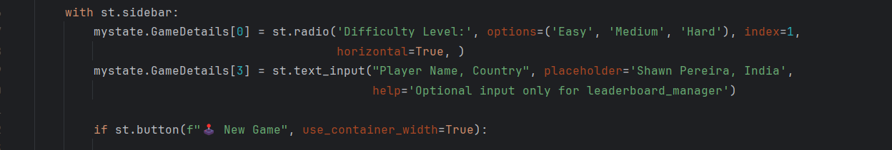
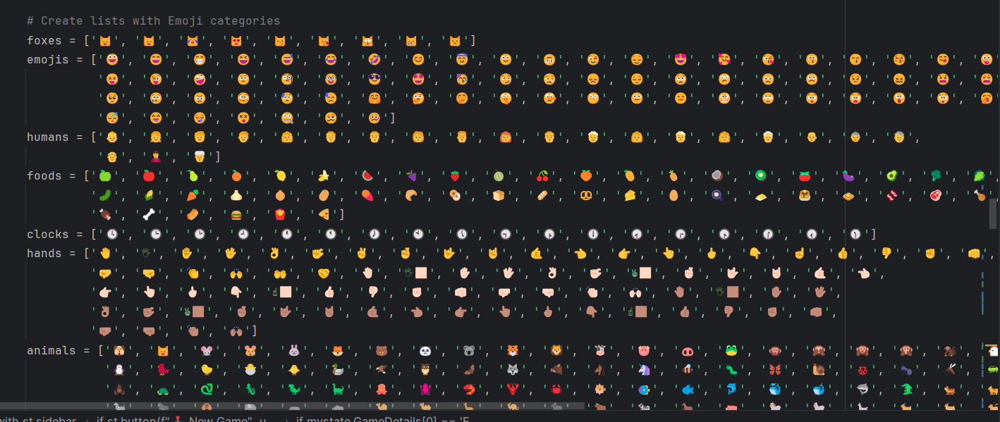
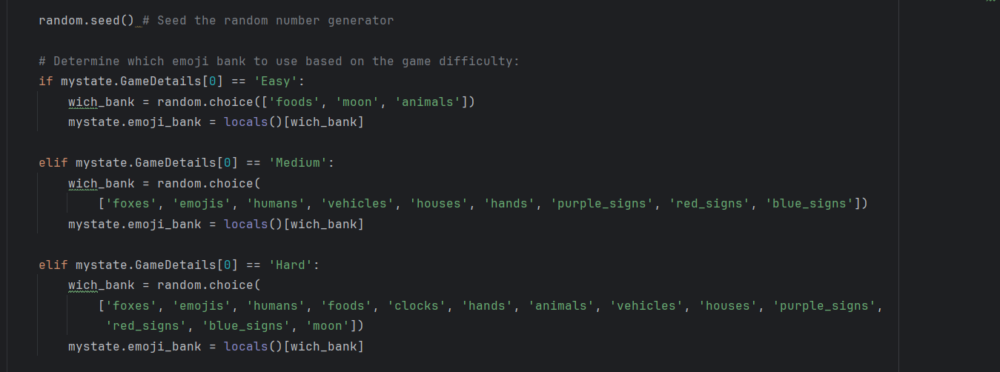
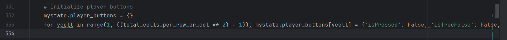
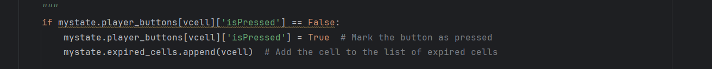
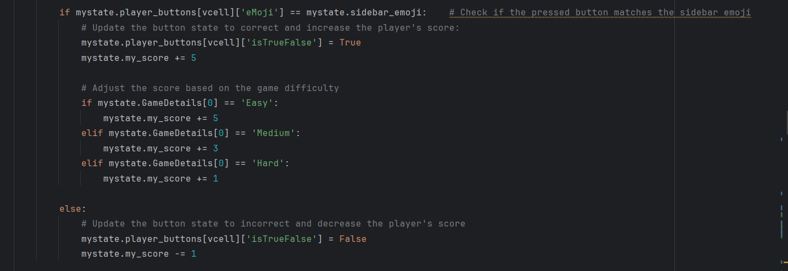
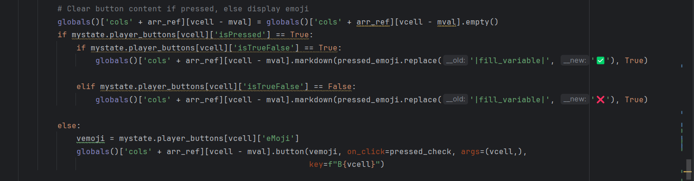
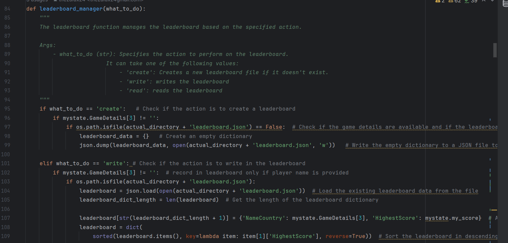
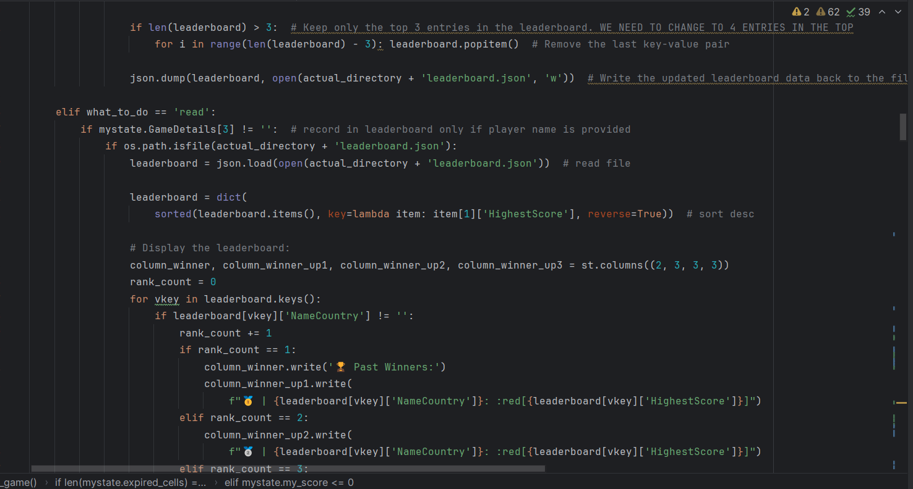
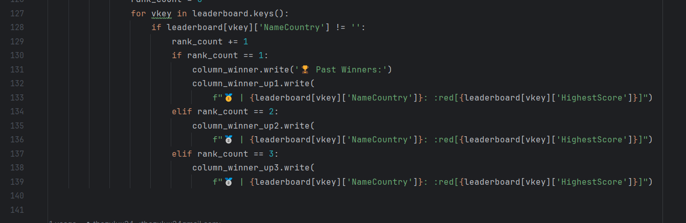

# Requistos vs código
## Requisitos Funcionales y Criterios de Aceptación

| Requisito y Criterios de Aceptación                                                                                                                                                                                                                                                                                                                                                                                                                                                                                                                                      | Código/Imagen                         |
|--------------------------------------------------------------------------------------------------------------------------------------------------------------------------------------------------------------------------------------------------------------------------------------------------------------------------------------------------------------------------------------------------------------------------------------------------------------------------------------------------------------------------------------------------------------------------|---------------------------------------|
| **1. Configuración de Nivel de Dificultad** **Requisito:** El sistema debe permitir a los jugadores seleccionar el nivel de dificultad antes de comenzar el juego. **Criterios de Aceptación:** - Opciones de dificultad fácil, medio y difícil disponibles para selección. - La configuración de dificultad debe influir en la mecánica del juego, como la frecuencia de regeneración de imágenes y la puntuación. - Tiempos de regeneración específicos:   - Fácil: cada 8 segundos.   - Medio: cada 6 segundos.   - Difícil: cada 5 segundos. |                    |
| **2. Ingreso de nombre y país:** **Requisito:** El sistema debe permitir ingresar el nombre y el país del jugador antes de iniciar el juego **Criterios de Aceptación:** - Debe haber un espacio donde el usuario pueda ingresar su nombre seguido de una "," y su país - en caso de no ingresar los datos de nombre y país, no se mostrará                                                                                                                                                                                                                  | 
| **3. Inicialización del tablero:** **Requisito:** Al comenzar un juego, el sistema debe inicializar el tablero con un conjunto aleatorio de imágenes basado en la dificultad seleccionada. **Criterios de Aceptación:** - El tablero se inicializará con un conjunto de emojis aleatorios los cuales seran determinados segun la dificultad  - el emoji a buscar será elegido aleatoriamente, por lo cual es posible que salga el mismo muchas veces  - Los emojis del tablero podran estar repetidos a excepcion del que el jugador debe seleccionar     |    |
| **4. Interacción del usuario con el tablero:** **Requisito:** El jugador debe poder escoger emojis del tablero para hacerlos coincidir con el emoji buscado. **Criterios de Aceptación:** - Los emojis serán representados como botones. - Cada emoji en el tablero solo podrá ser seleccionado una vez durante el juego.                                                                                                                                                                                                                                    |    |
| **5. Validaccion de seleccion y gestión de puntaje :** **Requisito:** El sistema debe ser capaz de gestionar y actualizar el puntaje del jugador en tiempo real, basado en las respuestas del usuario durante el juego. **Criterios de Aceptación:** - El sistema debe comparar el emoji objetivo con el emoji seleccionado por el usuario. - El sistema debe mostrar si la respuesta del jugador fue correcta o incorrecta. - El sistema debe sumar o restar puntos dependiendo de si la respuesta fue correcta o incorrecta.                            |   |
| **6. Gestion de tabla de ganadores :** **Requisito:** El sistema debe ser capaz de gestionar y actualizar la tabla de los jugadores con mayor puntaje en el juego. **Criterios de Aceptación:** - El sistema debe guardar a todos los ganadores que hayan colocado su nombre al iniciar el juego. - El sistema debe mostrar a los 4 mejores puntajes del juego. - El sistema debe asignar un emoji según la posición del jugador en la tabla de líderes.                                                                                                  |     |