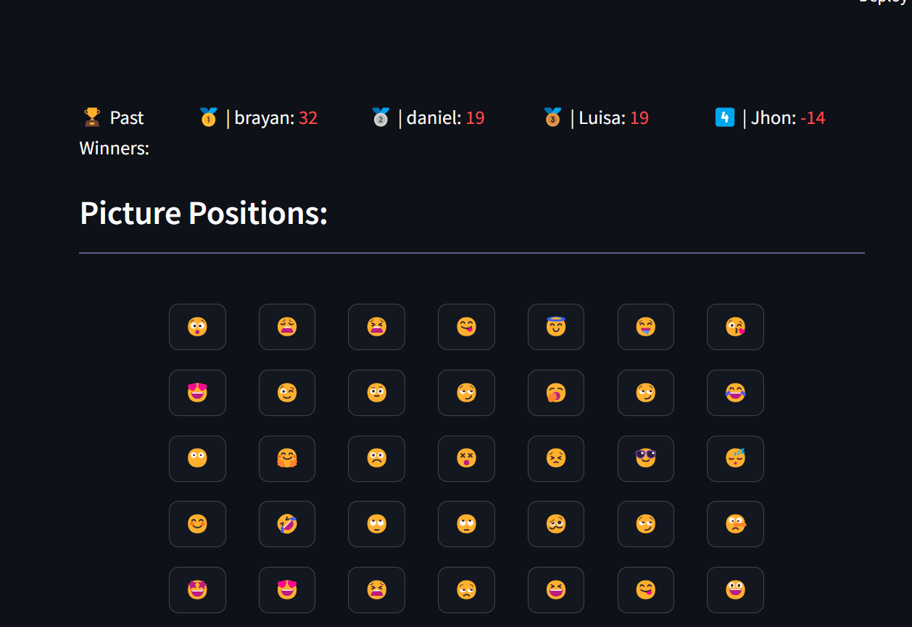
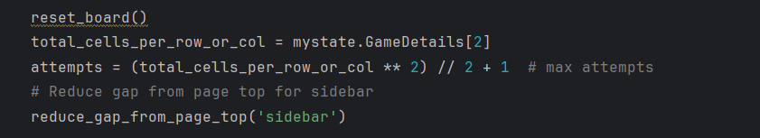
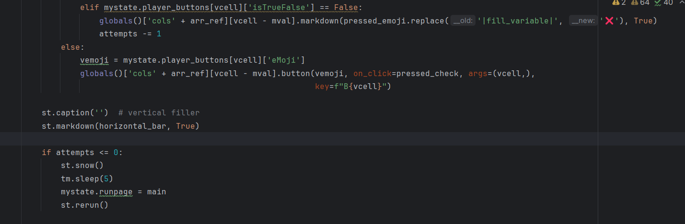

## Evidencia del cambio

#### Archivo Json guarda 4 jugadores
    elif what_to_do == 'write': # Check if the action is to write in the leaderboard
        if mystate.GameDetails[3] != '':  # record in leaderboard only if player name is provided
            if os.path.isfile(actual_directory + 'leaderboard.json'):
                leaderboard = json.load(open(actual_directory + 'leaderboard.json'))  # Load the existing leaderboard data from the file
                leaderboard_dict_length = len(leaderboard)  # Get the length of the leaderboard dictionary

                leaderboard[str(leaderboard_dict_length + 1)] = {'NameCountry': mystate.GameDetails[3], 'HighestScore': mystate.my_score}  # Add the current player's information to the leaderboard
                leaderboard = dict(
                    sorted(leaderboard.items(), key=lambda item: item[1]['HighestScore'], reverse=True))  # Sort the leaderboard in descending order based on the highest score

                if len(leaderboard) > 4:  # Keep only the top 4 entries in the leaderboard.
                    for i in range(len(leaderboard) - 4):
                        leaderboard.popitem()  # Remove the last key-value pair

                json.dump(leaderboard, open(actual_directory + 'leaderboard.json', 'w'))  # Write the updated leaderboard data back to the file

    elif what_to_do == 'read':
        if mystate.GameDetails[3] != '':  # record in leaderboard only if player name is provided
            if os.path.isfile(actual_directory + 'leaderboard.json'):
                leaderboard = json.load(open(actual_directory + 'leaderboard.json'))  # read file

                leaderboard = dict(
                    sorted(leaderboard.items(), key=lambda item: item[1]['HighestScore'], reverse=True))  # sort desc

#### Interfa gráfica muestra cuatro jugadores
                # Display the leaderboard:
                column_winner, column_winner_up1, column_winner_up2, column_winner_up3, column_winner_up4 = st.columns((2, 3, 3, 3, 3))
                rank_count = 0
                for vkey in leaderboard.keys():
                    if leaderboard[vkey]['NameCountry'] != '':
                        rank_count += 1
                        if rank_count == 1:
                            column_winner.write('🏆 Past Winners:')
                            column_winner_up1.write(
                                f"🥇 | {leaderboard[vkey]['NameCountry']}: :red[{leaderboard[vkey]['HighestScore']}]")
                        elif rank_count == 2:
                            column_winner_up2.write(
                                f"🥈 | {leaderboard[vkey]['NameCountry']}: :red[{leaderboard[vkey]['HighestScore']}]")
                        elif rank_count == 3:
                            column_winner_up3.write(
                                f"🥉 | {leaderboard[vkey]['NameCountry']}: :red[{leaderboard[vkey]['HighestScore']}]")
                        elif rank_count == 4:
                            column_winner_up4.write(
                                f"4️⃣ | {leaderboard[vkey]['NameCountry']}: :red[{leaderboard[vkey]['HighestScore']}]")

#### Usuario pierde el juego cuando supera un máximo posible de fallos.

## Encuesta de la experiencia
Por favor, responde las siguientes preguntas basadas en tu experiencia modificando el código para incluir cuatro personas en el leaderboard en lugar de tres.

**Nombre:**

#### 1. ¿Cuánto tiempo te llevó entender las secciones del código relacionada con el leaderboard?
- [ ] Menos de 10 minutos
- [x] Entre 10 y 30 minutos
- [ ] Entre 30 minutos y 1 hora
- [ ] Más de 1 hora

#### 2. ¿Cuánto tiempo te llevó entender las secciones del código relacionada con hacer que el usuario pierda si supera x cantidad de turnos?
- [x] Menos de 10 minutos
- [ ] Entre 10 y 30 minutos
- [ ] Entre 30 minutos y 1 hora
- [ ] Más de 1 hora

#### 3. ¿Consideras que estaba documentada la lógica en el código para facilitar el cambio?
- [ ] Sí
- [x] No

#### 4. ¿Te pareció fácil identificar dónde y qué cambios realizar para aumentar el número de personas en el leaderboard de 3 a 4?
- [ ] Muy fácil
- [x] Algo fácil
- [ ] Algo difícil
- [ ] Muy difícil

#### 5. ¿Te pareció fácil identificar dónde y qué cambios realizar para agregar la lógica de perder el juego?
- [x] Muy fácil
- [ ] Algo fácil
- [ ] Algo difícil
- [ ] Muy difícil

#### 5. ¿Qué tan seguro te sientes de que tus cambios no introdujeron errores en otras áreas del código?
- [ ] Muy seguro
- [x] Moderadamente seguro
- [ ] Poco seguro
- [ ] Nada seguro

#### 6. Después de realizar los cambios, ¿cuánto tiempo te tomó verificar que el cambio funcionó como se esperaba?
- [ ] Menos de 10 minutos
- [x] Entre 10 y 30 minutos
- [ ] Entre 30 minutos y 1 hora
- [ ] Más de 1 hora

#### 7. ¿Qué estrategia usaste para verificar que no habían problemas en el código fuente?

** probando varias veces el juego

#### 8. ¿Te enfrentaste a algún problema mientras intentabas realizar los cambios? Si es así, ¿cómo lo resolviste?
- [ ] No enfrenté problemas
- [ ] Revisé la documentación del código
- [ ] Busqué ayuda de un compañero o en línea
- [x] Otro (especificar)

** tuve un pequeño problema y fue con el JSON, no guardaba el ultimo jugador, por lo que lo borré y se solucionó

